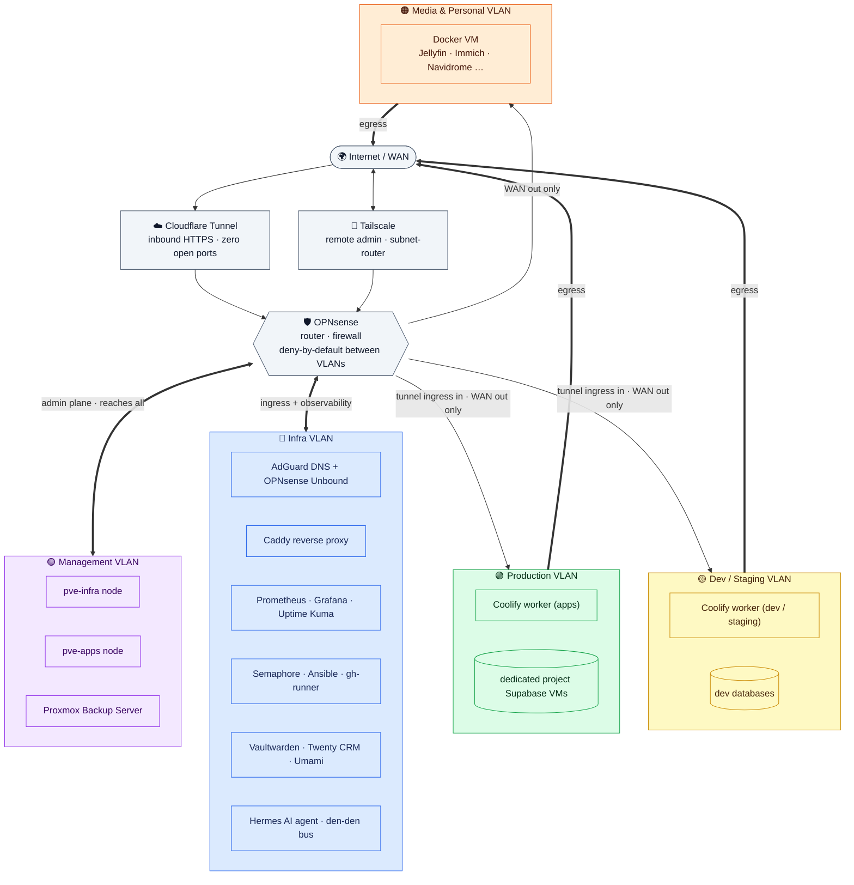

# 🏠 Homelab

<p align="center">
  &nbsp;&nbsp;
  &nbsp;&nbsp;
  &nbsp;&nbsp;
  &nbsp;&nbsp;
  &nbsp;&nbsp;
  &nbsp;&nbsp;
  &nbsp;&nbsp;
  &nbsp;&nbsp;
  &nbsp;&nbsp;
  
</p>

Infrastructure-as-documentation for my self-hosted lab — a two-node Proxmox setup
running dev/staging environments, internal tooling, full observability, a 24/7
self-hosted LLM agent, CRM, analytics, isolated project databases, and personal media services.

> **Design philosophy:** public production for clients lives on managed cloud
> (Vercel, Supabase Cloud, Cloudflare). Everything else — dev, staging, internal
> tools, and personal apps — runs on the homelab.

This repo is a **sanitized** snapshot of the architecture. Internal addressing,
host identifiers, customer names, and domains are intentionally omitted.

---

## 🧱 Compute & Hardware

Two standalone Proxmox nodes (no cluster — independent hosts, backed up by a
shared Proxmox Backup Server). Both are low-power 8th-gen Intel mini-PCs (35 W
TDP each), keeping the entire lab silent and cheap to run 24/7.

| Node | Role | CPU | RAM | Storage |
|------|------|-----|-----|---------|
| `pve-infra` | Networking, infra services, monitoring, backup, fleet automation, LLM agent, CRM, analytics, media & personal apps | Intel Core i5-8500T — 6C / 6T · 2.1 → 3.5 GHz · 35 W | 32 GB DDR4-2933 (2 × 16) | 1 TB NVMe (Crucial P310) + 500 GB 2.5″ SSHD |
| `pve-apps`  | Local production, dev / staging, dedicated project databases, OpenTofu state backend, client AI demo | Intel Core i3-8100T — 4C / 4T · 3.1 GHz · 35 W | 32 GB DDR4-2667 (2 × 16) | 500 GB NVMe (Samsung 980) + 500 GB 2.5″ HDD |

On each host, the NVMe carries the VM and LXC volumes (thin-provisioned LVM)
and the 2.5″ drive holds backups and media. Each host runs a single
VLAN-aware bridge (`vmbr0`); workloads are separated across functional VLANs (one
`/24` per VLAN).

> **Database node roadmap:** A third dedicated Proxmox mini-node (**Minisforum MS-A2 — AMD Ryzen 9 9955HX, 16C/32T, 96–128 GB DDR5, dual 10 GbE SFP+**)
> is planned to absorb all PostgreSQL / Supabase project databases, freeing RAM
> on the existing compute hosts.

---

## 🌐 Network Segmentation & Firewall

Routing, inter-VLAN filtering, and gateway services are handled by **OPNsense**.
Traffic between VLANs is **deny-by-default**; only explicit flows are allowed.



> **Zero open inbound ports.** Public traffic is routed strictly through an outbound
> **Cloudflare Tunnel**; administration access goes exclusively through an authenticated
> **Tailscale** subnet router. Everything crossing VLANs goes through OPNsense.

| VLAN | Purpose | Egress policy |
|------|---------|---------------|
| 🟣 Management | Proxmox hosts, backup server, OPNsense admin | Reaches everything (admin plane, Tailscale/LAN only) |
| 🔵 Infra | Ingress tunnel, DNS, reverse proxy, monitoring, automation, CRM, AI | Routes to Prod / Dev / Media |
| 🟢 Production | Local prod apps + dedicated project databases | **WAN only** — completely isolated from other VLANs |
| 🟡 Dev / Staging | Ephemeral dev environments and staging databases | **WAN only** — zero access to Prod |
| 🟠 Media & Personal | Consolidated Docker host (media, photos, files) | **WAN only** — a compromised torrent client stays strictly contained |

### Edge, DNS & Core Services

| | Service | Role |
|:--:|---------|------|
|  | **OPNsense** | Router + firewall, inter-VLAN routing, Unbound DNS secondary |
|  | **Cloudflare Tunnel** | HTTPS ingress for exposed services (zero public ports open, Cloudflare Access email OTP on admin consoles) |
|  | **Caddy** | Internal reverse proxy routing `*.lab` domains with local TLS root CA |
|  | **AdGuard Home** | Local DNS with network-wide ad/tracker blocking |
|  | **Tailscale** | Zero-trust WireGuard remote access via an unprivileged LXC subnet-router (advertising internal subnets) |
|  | **Vaultwarden** | Self-hosted password vault (Argon2id hashing, Bitwarden compatible) |
|  | **Twenty CRM** | Self-hosted modern CRM (Docker stack with PostgreSQL 16 & Redis 7) |
|  | **Umami Analytics** | Lightweight, privacy-focused self-hosted web analytics |

#### DNS High Availability (`*.lab`)
To eliminate the Single Point of Failure (SPOF) on internal name resolution:
- **Primary resolver:** AdGuard Home rewrites `*.lab` to Caddy.
- **Secondary fallback:** OPNsense Unbound DNS carries a wildcard host-override `*.lab -> <caddy-ip>`.
If AdGuard restarts or is updated, internal `.lab` routing continues transparently without DNS lookup failures.

---

## 📊 Observability

| | Service | Role |
|:--:|---------|------|
|   | **Prometheus + Grafana** | One central metrics stack for the lab; `node_exporter` on all hypervisors, VMs, and LXCs |
|  | **Uptime Kuma** | Periodic HTTP checks on every service with **instant Telegram alert on any `DOWN`** |
|  | **Glance** | Custom 4-page dashboard (*Accueil*, *Infra*, *Topology*, *Ressources*) with live host stats and storage monitoring |

> **Observability doctrine:** Loki was evaluated and **decommissioned**. In a solo lab, centralized log indexing consumed significant RAM and NVMe I/O for logs that were never queried proactively. Logs are inspected on demand (`journalctl`, `docker logs`). Observability you don't use is waste.

---

## ⚙️ Provisioning & Fleet Automation

Three layers, each fulfilling a single responsibility:

| | Layer | Tool | Job |
|:--:|-------|------|-----|
|  | Infrastructure | **OpenTofu** (Proxmox provider) | VMs/LXCs declared as code — adopted **brownfield by `import`**, state stored on a dedicated PostgreSQL backend (`pg-state`), CI plan verification via a self-hosted GitHub Actions runner (`gh-runner`) |
|   | Post-provisioning | **Ansible + Semaphore** | Idempotent configuration of the whole fleet (~18 targets) from a web UI; playbooks versioned on GitHub and pulled via a **read-only deploy key** |
|  | Application PaaS | **Coolify** | Self-hosted PaaS for containerized applications · split control plane |

### Worker Isolation & Dedicated Databases
Coolify operates with strict plane separation:
- The **orchestrator VM runs 0 applications** — preventing control plane starvation.
- Applications run on dedicated worker VMs (one for local production, one for dev/staging).
- **One project = one dedicated database VM:** Rather than sharing a monolithic database instance, production projects receive an isolated Supabase VM (`pve-apps`, VLAN 30) exposed only through the Cloudflare Tunnel.
- Databases run `qemu-guest-agent` for filesystem freeze/thaw during backups, and execute nightly encrypted logical dumps (`pg_dump` AES-256-CBC) before snapshots.

### ☸️ The Kubernetes Chapter (Retrospective)
A 3-node HA k3s cluster (embedded etcd, MetalLB in L2 mode, ArgoCD GitOps) was deployed in the Dev VLAN to benchmark real-world Kubernetes operations and rehearse migration paths off PaaS solutions. After validating end-to-end GitOps pipelines and Alloy remote-write metric federation, the cluster was **retired in August 2026** to eliminate ~5 GB of continuous RAM overhead. Standalone services (such as Umami analytics) were migrated to streamlined LXC containers. Manifests and architecture notes remain preserved in [`homelab-k8s`](https://github.com/ibhugeloo/homelab-k8s).

---

## 🤖 Self-Hosted AI Architecture

The homelab runs an autonomous AI assistant pipeline 24/7:

- **Hermes / Leo** (LXC on Srv1): Runs Nous Research Hermes agent with open-weights LLM backends.
- **Interfaces:** Connected to Telegram for real-time operations, and integrated with Nostr/Buzz (channel `#convergence` mirroring operator interactions).
- **Headless Computer Use:** Equipped with `cua-driver` and an automated virtual display stack (`Xvfb`, `openbox`, D-Bus session, AT-SPI accessibility tree) for headless browser and GUI automation.
- **Security boundary:** Operates with a **read-only mirror** of personal knowledge notes — can query context freely, cannot mutate storage.
- **den-den:** Lightweight inter-agent communication bus facilitating multi-agent coordination.
- **agent-demo** (VM on Srv2): Dedicated client sandbox running Hermes, n8n, Baserow, and PostgreSQL with `pgvector` for client demonstration workflows.

---

## 🎬 Media & Personal Stack

All media and personal services are consolidated on a **single Debian 12 Docker VM** (500 GB storage) on `pve-infra` in the Media VLAN (VLAN 50).

| | Service | Image | Role |
|:--:|---------|-------|------|
|  | **Jellyfin** | `jellyfin/jellyfin:latest` | Movie / TV / music streaming |
|  | **Immich v3** | `ghcr.io/immich-app/immich-server:v3.0.2` | Self-hosted photo/video backup with VectorChord (`vchord 0.4.3`) |
|  | **qBittorrent** | `lscr.io/linuxserver/qbittorrent` | Torrent client (manual acquisition) |
|  | **Navidrome** | `deluan/navidrome:latest` | Music streaming server (Subsonic API) |
|  | **MeTube** | `ghcr.io/alexta69/metube` | yt-dlp web downloader |
|  | **Filebrowser** | `filebrowser/filebrowser:latest` | Web file management interface |

> **Anti-bloat rule:** Zero `*arr` automation suites (no Sonarr, Radarr, Prowlarr). Torrent acquisitions are initiated manually; playback is handled directly via Jellyfin and Navidrome.

### Data Layout

```
/data/
├── files/                ← Filebrowser
├── photos/               ← Immich
└── media/
    ├── movies/           ← Jellyfin (films)
    ├── tv/               ← Jellyfin (series)
    ├── music/            ← Navidrome + MeTube (audio)
    └── downloads/        ← qBittorrent + MeTube (downloads)
```

---

## 🔒 Security & On-Demand Pentesting

- **Isolated Kali Pentest Box:** A dedicated VM (`kali-pentest`) on Srv1 configured with a **trunk interface** (VLAN-aware bridge without tags) allows auditing any VLAN at Layer 2 (including production segmentation checks).
- **Mitigation:** The pentest VM is **strictly powered off by default (`onboot=0`)** and booted solely during scheduled security reviews, ensuring zero persistent trunk exposure.

---

## 💾 Backup — 3-2-1 Strategy

1.  **Proxmox Backup Server (PBS):** Daily incremental, deduplicated, and chunk-level verified snapshots of all VMs and LXCs. Uses per-node namespaces (`srv1`, `srv2`) to prevent retention pruning collisions across independent hosts.
2. **On-Site Secondary Storage:** Secondary physical 500 GB drive on `pve-infra` holding PBS datastores and configuration snapshots.
3.  **Encrypted Offsite (Backblaze B2):** Nightly automated `rclone` sync with **client-side encryption (`rclone crypt`)** pushing critical datastores (databases, photos, configs) to Backblaze B2.
4. **Firewall Config Offsite:** Automated daily export and encryption of OPNsense configuration XML synced directly to B2 offsite storage.
5. **Time Machine:** Dedicated Samba SMB target on Srv1 with strict quota enforcement (200 GB) accessible directly via gigabit LAN.

**Data criticality:** Photo library & databases 🔴 (snapshot + logical dump) · Docker configurations 🟡 · Bulk media 🟢 (re-downloadable).

---

## 📁 Repository Layout

```
.
├── docs/                  → architecture & operations guides
│   ├── architecture.md
│   └── operations.md
└── docker-compose/        → media-VM service stacks
    ├── filebrowser/
    ├── immich/
    ├── jellyfin/
    ├── metube/
    ├── navidrome/
    └── qbittorrent/
```

Each service directory contains a sanitized `docker-compose.yml` and `.env.example`. Real secrets live in gitignored environment files and are **never** committed.

---

## ⚖️ License

MIT — see [`LICENSE`](./LICENSE). Provided as an architectural blueprint and reference.
