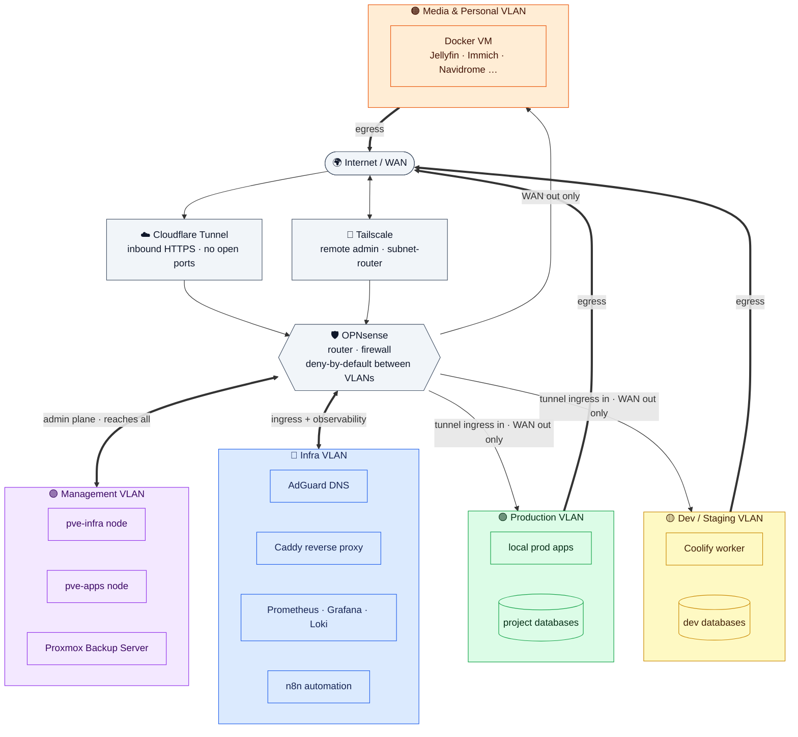

# 🏠 Homelab

Infrastructure-as-documentation for my self-hosted lab — a two-node Proxmox setup
running my dev/staging environments, internal tooling, monitoring, and personal
media services.

> **Design philosophy:** public production for clients lives on managed cloud
> (Vercel, Supabase Cloud, Cloudflare). Everything else — dev, staging, internal
> tools, and personal apps — runs on the homelab.

This repo is a **sanitized** snapshot of the architecture. Internal addressing,
host identifiers, and domains are intentionally omitted.

---

## 🧱 Compute

Two standalone Proxmox nodes (no cluster — independent hosts, backed up by a
shared Proxmox Backup Server). Both are low-power 8th-gen Intel mini-PCs (35 W
TDP each), so the whole lab stays quiet and cheap to run 24/7.

| Node | Role | CPU | RAM | Storage |
|------|------|-----|-----|---------|
| `pve-infra` | Networking, infra services, monitoring, backup, media & personal apps | Intel Core i5-8500T — 6C / 6T · 2.1 → 3.5 GHz · 35 W | 32 GB DDR4-2933 (2 × 16) | 1 TB NVMe (Crucial P310) + 500 GB 2.5″ SSHD |
| `pve-apps`  | Local production, dev / staging, project databases | Intel Core i3-8100T — 4C / 4T · 3.1 GHz · 35 W | 32 GB DDR4-2667 (2 × 16) | 500 GB NVMe (Samsung 980) + 500 GB 2.5″ HDD |

On each host the NVMe carries the VM / LXC volumes (thin-provisioned LVM) and the
2.5″ spinner holds backups and bulk media. Each host runs a single VLAN-aware
bridge; VMs and LXC containers are split across functional VLANs (one `/24` per
VLAN).

---

## 🌐 Network segmentation

Routing and firewalling are handled by **OPNsense**. Traffic between VLANs is
deny-by-default; only the flows below are allowed.



> **Two ways in, gated by one firewall.** Public services are reached only through
> an outbound **Cloudflare Tunnel** (no inbound ports), admin access only through
> **Tailscale**. Everything inter-VLAN crosses OPNsense, which is deny-by-default —
> the table below is the full allow-list.

| VLAN | Purpose | Egress policy |
|------|---------|---------------|
| 🟣 Management | Proxmox hosts, backup server, OPNsense | Reaches everything (admin plane, VPN-only) |
| 🔵 Infra | Tunnel ingress, DNS, reverse proxy, monitoring, automation | Routes to Prod / Dev / Media |
| 🟢 Production | Local prod apps + project databases | **WAN only** — isolated from other VLANs |
| 🟡 Dev / Staging | Ephemeral app + database environments | **WAN only** — zero access to Prod |
| 🟠 Media & Personal | Single Docker host (see below) | **WAN only** — a compromised torrent client can't reach business apps |

### Edge & core services

- **OPNsense** — router + firewall, inter-VLAN routing.
- **Cloudflare Tunnel** — HTTPS ingress for exposed services (no public ports open).
- **Caddy** — internal reverse proxy.
- **AdGuard Home** — local DNS with ad/tracker blocking.
- **Tailscale** — zero-trust remote access via a subnet-router (advertises the
  internal VLAN ranges, not the home LAN).

### Observability

- **Prometheus + Grafana + Loki** — metrics & logs.
- **Uptime Kuma** — uptime/status checks.
- **Glance** — at-a-glance service dashboard.

### Automation & platform

- **Coolify** — self-hosted PaaS for dev/staging deployments.
- **n8n** — workflow automation.

---

## 🎬 Media & personal stack

All media and personal apps run as Docker containers on a **single VM** in the
Media VLAN (Debian 12 + Docker). No per-service LXCs, no `*arr` automation —
acquisition is manual, playback is via Jellyfin.

| Service | Image | What it does |
|---------|-------|--------------|
| **Jellyfin** | `jellyfin/jellyfin` | Movies / TV / music streaming |
| **Immich** | `ghcr.io/immich-app/immich-server` | Self-hosted photo & video backup (with ML + Postgres + Redis) |
| **qBittorrent** | `lscr.io/linuxserver/qbittorrent` | Torrent client |
| **Navidrome** | `deluan/navidrome` | Music streaming (Subsonic API) |
| **MeTube** | `ghcr.io/alexta69/metube` | yt-dlp web frontend |
| **Filebrowser** | `filebrowser/filebrowser` | Web file manager |

Compose files for each live in [`docker-compose/`](./docker-compose/).

### Data layout

```
/data/
├── files/                ← Filebrowser
├── photos/               ← Immich
└── media/
    ├── movies/           ← Jellyfin (films)
    ├── tv/               ← Jellyfin (series)
    ├── music/            ← Navidrome + MeTube (audio)
    └── downloads/        ← qBittorrent + MeTube (video)
```

---

## 💾 Backup — 3-2-1

1. **Proxmox Backup Server** — daily snapshots of every VM/LXC across both nodes.
2. **Second copy** — replicated to a separate volume/medium.
3. **Offsite** — `rclone` to Backblaze B2 for critical data (prod apps, databases, photos).

Criticality: photos 🔴 (snapshot + DB dump) · Docker configs 🟡 · re-downloadable media 🟢.

---

## 🚀 Deployment rule

- ☁️ **Managed cloud** (Vercel + Supabase Cloud + Cloudflare): critical databases,
  delivered client projects, public production.
- 🏠 **Homelab**: dev/staging, database-less landing pages, internal tooling
  (n8n, monitoring), personal apps (Jellyfin, Immich…).

---

## 📁 Repo layout

```
.
├── docs/                  → architecture & operations notes
└── docker-compose/        → media-VM service stacks (one folder per service)
    ├── jellyfin/
    ├── immich/
    ├── qbittorrent/
    ├── navidrome/
    ├── metube/
    └── filebrowser/
```

Each service folder ships a `docker-compose.yml` and a `.env.example`. Real
secrets live in a gitignored `.env` and are **never** committed.

---

## ⚖️ License

MIT — see [`LICENSE`](./LICENSE). Configs are provided as reference; always check
each image's official docs before reuse.
