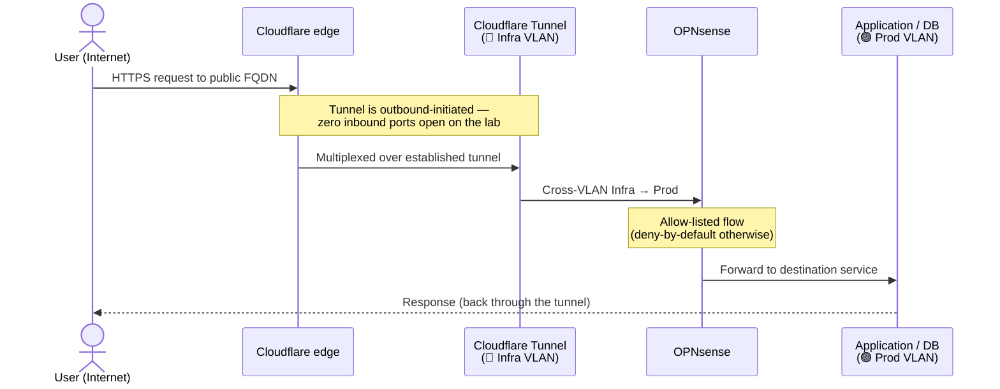
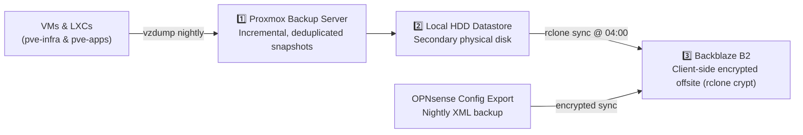

# Architecture

A sanitized architectural overview of the homelab. Internal IP addresses,
VM/container IDs, customer project names, and private domains are omitted.

---

## 1. Principles

- **Two standalone Proxmox nodes**, not a cluster. Eliminates quorum failure modes,
  simplifies maintenance, and bounds blast radius. A shared Proxmox Backup Server
  protects both.
- **Cloud for high availability, homelab for everything else.** Client-facing
  production and critical business databases live on managed cloud providers
  (Vercel, Supabase Cloud, Cloudflare). The homelab hosts dev/staging environments,
  internal tools, CRM, AI agents, and personal apps.
- **Deny-by-default network segmentation.** Functional VLANs are isolated at Layer 3;
  inter-VLAN communication is strictly allow-listed.
- **Zero open inbound ports.** Public ingress is exclusively routed through an
  outbound Cloudflare Tunnel; remote administration is secured via Tailscale WireGuard.

---

## 2. Compute Nodes

| Node | Role |
|------|------|
| `pve-infra` | Routing & firewall (OPNsense), tunnel ingress, DNS, reverse proxy, observability, backup server, fleet automation (Semaphore), CI runner, CRM (Twenty), analytics (Umami), workflow automation (n8n), AI assistant (Hermes), media & personal applications, on-demand pentest box |
| `pve-apps`  | Application workers (Coolify), dedicated project database VMs, OpenTofu state backend, client AI demonstration environment |

### Hardware Specifications

Both nodes are low-power 8th-gen Intel mini-PCs (35 W TDP), optimized for 24/7
quiet and energy-efficient operation.

| Node | CPU | RAM | Storage |
|------|-----|-----|---------|
| `pve-infra` | Intel Core i5-8500T — 6C / 6T · 2.1 → 3.5 GHz · 35 W | 32 GB DDR4-2933 (2 × 16) | 1 TB NVMe (Crucial P310) — VM/LXC volumes 500 GB 2.5″ SSHD — backups + bulk media |
| `pve-apps`  | Intel Core i3-8100T — 4C / 4T · 3.1 GHz · 35 W | 32 GB DDR4-2667 (2 × 16) | 500 GB NVMe (Samsung 980) — VM/LXC volumes 500 GB 2.5″ HDD — bulk / backup |

On each host, the NVMe carries active VM and LXC volumes formatted as thin-provisioned
LVM (`local-lvm`). Secondary rotational disks hold the Proxmox Backup Server
datastore, Time Machine bundles, and re-downloadable media.

Workloads use lightweight LXC containers for single-purpose Linux services and
full KVM virtual machines where isolation, kernel control, or guest agents are
required (databases, PaaS workers, Docker hosts).

### Dedicated Database Node Target
To relieve memory pressure on the existing 32 GB nodes, an AMD-based mini-PC
is slated as the dedicated database host:
- **Minisforum MS-A2 — AMD Ryzen 9 9955HX, 16C / 32T**
- **RAM:** 96 GB to 128 GB DDR5
- **Networking:** 2× SFP+ 10 Gb/s + 2× RJ45 2.5 Gb/s
- **Storage:** 1 NVMe for Proxmox VE + 2 NVMe in ZFS mirror for database VMs

---

## 3. VLAN Map & Firewall Matrix

Each hypervisor runs a single VLAN-aware Linux bridge (`vmbr0`). OPNsense operates
as the default gateway (`.1`) for all subnets.

| VLAN | Purpose | Inter-VLAN Policy |
|------|---------|-------------------|
| 🟣 Management | Proxmox hypervisors, backup server, firewall administration | Reaches all (admin plane, Tailscale/LAN only) |
| 🔵 Infra | Tunnel ingress, DNS, reverse proxy, monitoring, automation, CRM, AI | Routes to Prod / Dev / Media |
| 🟢 Production | Local production apps + dedicated project database VMs | **WAN only** — completely isolated from other VLANs |
| 🟡 Dev / Staging | Ephemeral dev environments and staging databases | **WAN only** — zero access to Prod |
| 🟠 Media & Personal | Consolidated Docker VM (media, photos, files) | **WAN only** — contained from business and client services |

### Firewall Matrix (Inter-VLAN)

| Source | → Destination | Policy |
|--------|---------------|--------|
| 🟣 Management | ALL | Admin plane reaches everything |
| 🔵 Infra | Prod / Dev / Media | Reverse proxy & tunnel ingress route to applications |
| 🟢 Production | WAN only | Production cannot initiate connections into internal VLANs |
| 🟡 Dev | WAN only | Dev environments can never touch Production |
| 🟠 Media | WAN only | Torrent client and media services cannot pivot into corporate data |

---

## 4. Ingress & Request Lifecycle

Public requests reach exposed applications without opening a single inbound firewall port:

- **Cloudflare Access:** Sensitive web consoles (such as Coolify PaaS and Vaultwarden admin)
  are gated behind Cloudflare Access with email OTP authorization before reaching the origin.
- **Tailscale Admin Plane:** Operator administration bypasses the public edge entirely.
  The operator connects via WireGuard into an unprivileged Tailscale subnet-router
  in the Management/Infra segments.

---

## 5. Core Services Directory

| Function | Service | Details |
|----------|---------|---------|
| Router & firewall | OPNsense | Gateway for all VLANs, inter-VLAN rule enforcement |
| Public ingress | Cloudflare Tunnel | Outbound-only tunnel managed via Zero Trust API |
| Internal reverse proxy | Caddy | Routes `*.lab` internal hostnames with local CA root certificates |
| Local DNS & filtering | AdGuard Home | Primary DNS resolver with network-wide ad/telemetry blocking |
| Secondary DNS fallback | OPNsense Unbound | Wildcard host-override `*.lab` preventing SPOF during AdGuard maintenance |
| Remote access | Tailscale | Subnet-router LXC with TUN passthrough for secure P2P access |
| Observability | Prometheus + Grafana | Central metrics scraper; `node_exporter` across all nodes and VMs |
| Uptime monitoring | Uptime Kuma | Active HTTP health probes with Telegram alerting |
| Dashboard | Glance | 4-page unified operational portal (*Accueil*, *Infra*, *Topology*, *Ressources*) |
| Infrastructure as Code | OpenTofu | Proxmox VMs & LXCs as code; state stored on dedicated PostgreSQL |
| CI runner | gh-runner | Self-hosted GitHub Actions runner validating OpenTofu plans |
| Fleet configuration | Ansible + Semaphore | GitOps-driven configuration management via read-only GitHub deploy keys |
| Application PaaS | Coolify | Isolated control plane VM with dedicated worker VMs for container deployments |
| CRM | Twenty CRM | Modern open-source CRM (Docker stack with PostgreSQL 16 and Redis 7) |
| Web analytics | Umami | Cookie-free, privacy-preserving web analytics stack |
| Password vault | Vaultwarden | Bitwarden-compatible password manager with Argon2id hash derivation |
| Workflow automation | n8n | Webhook automation and external integration flows |
| 24/7 AI agent | Hermes (Leo) | Nous Research Hermes LLM agent with Telegram, Nostr/Buzz, and headless Computer Use |
| Inter-agent bus | den-den | Lightweight coordination bus for multi-agent workflows |
| Security auditing | Kali Pentest VM | Trunk interface VM on Srv1; kept powered off (`onboot=0`) except during audits |

> **Logging strategy:** Centralized logging (Loki) was decommissioned after evaluating
> real-world utility. For a solo SRE lab, centralized log indexing incurred high NVMe
> wear and continuous RAM overhead with near-zero proactive usage. Logs are inspected
> via targeted CLI commands (`journalctl`, `docker logs`).

---

## 6. Databases & Data Consistency

- **VM-per-Project Isolation:** Heavy production databases run in dedicated virtual
  machines on `pve-apps` (VLAN 30) using self-hosted Supabase instances. This isolates
  resource contention, maintenance windows, and blast radiuses.
- **Application-Consistent Snapshots:** All database VMs run `qemu-guest-agent`. Proxmox
  Backup Server issues guest filesystem freeze (`fsfreeze`) prior to volume snapshotting
  and unfreezes immediately after, ensuring consistent database state on disk.
- **Nightly Logical Dumps:** An automated systemd timer runs `pg_dump` every night,
  encrypting the dump (`AES-256-CBC`) and storing it locally prior to hypervisor backup.

---

## 7. Backup Architecture (3-2-1)

1. **Proxmox Backup Server (PBS):** Daily snapshots across both nodes. Uses per-node
   namespaces (`srv1`, `srv2`) to prevent retention pruning conflicts between
   identically numbered VMIDs across standalone hosts.
2. **Second Local Copy:** Primary datastore lives on a dedicated physical disk on `pve-infra`.
3. **Encrypted Offsite (Backblaze B2):** Nightly systemd timer executes an `rclone`
   sync using client-side encryption (`rclone crypt`). Backblaze receives only opaque,
   encrypted blobs.
4. **Firewall XML Export:** Daily automated OPNsense configuration dump encrypted and
   shipped to the offsite vault.
5. **Time Machine:** Dedicated Samba share on `pve-infra` with hard quota enforcement (200 GB)
   and a direct gigabit LAN interface.
