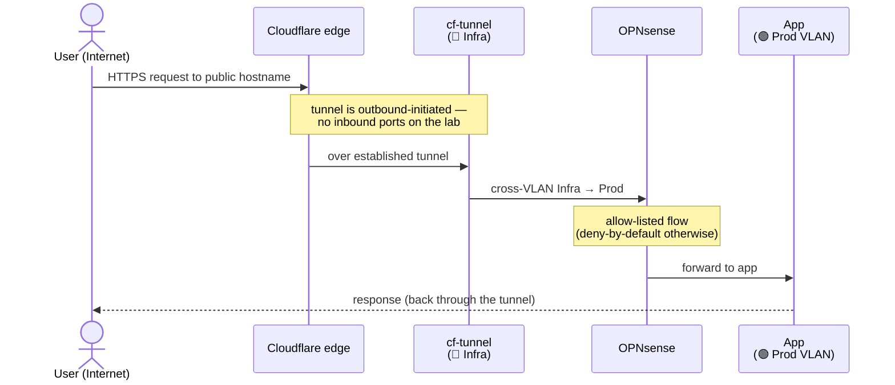

# Architecture

A sanitized overview of the lab. Internal IPs, VM/container IDs, and domains are
omitted on purpose.

## Principles

- **Two standalone Proxmox nodes**, not a cluster. Simpler blast radius; a single
  Proxmox Backup Server protects both.
- **Cloud for what must never go down**, homelab for everything else. Client
  production and critical databases live on managed cloud; the lab carries dev,
  staging, internal tooling, and personal apps.
- **Deny-by-default networking.** VLANs are isolated; only explicit inter-VLAN
  flows are permitted.
- **Nothing exposed via open ports.** Public reachability goes exclusively through
  a Cloudflare Tunnel; remote admin goes through Tailscale.

## Nodes

| Node | Role |
|------|------|
| `pve-infra` | Networking (OPNsense), tunnel ingress, DNS, reverse proxy, monitoring, backup, automation, media & personal apps, remote-access agent |
| `pve-apps`  | Local production apps, dev/staging environments, per-project databases |

### Hardware

Both nodes are low-power 8th-gen Intel mini-PCs (35 W TDP), chosen for a quiet,
cheap 24/7 lab rather than raw throughput.

| Node | CPU | RAM | Storage |
|------|-----|-----|---------|
| `pve-infra` | Intel Core i5-8500T — 6C / 6T · 2.1 → 3.5 GHz · 35 W | 32 GB DDR4-2933 (2 × 16) | 1 TB NVMe (Crucial P310) — VM/LXC volumes · 500 GB 2.5″ SSHD — backups + bulk media |
| `pve-apps`  | Intel Core i3-8100T — 4C / 4T · 3.1 GHz · 35 W | 32 GB DDR4-2667 (2 × 16) | 500 GB NVMe (Samsung 980) — VM/LXC volumes · 500 GB 2.5″ HDD — bulk / backup |

VM/LXC volumes sit on the NVMe as thin-provisioned LVM; the 2.5″ spinner carries
the Proxmox Backup Server datastore and re-downloadable media. Both nodes ship
32 GB; `pve-infra` carries the larger 1 TB NVMe to hold the media library.

Each host uses one VLAN-aware Linux bridge. Workloads are LXC containers for
lightweight single-purpose services and full VMs where isolation or a dedicated
kernel matters (databases, Docker hosts, monitoring).

## VLAN map

| VLAN | Purpose | Inter-VLAN policy |
|------|---------|-------------------|
| 🟣 Management | Proxmox hosts, backup server, firewall mgmt | Reaches all (VPN/Tailscale only) |
| 🔵 Infra | Cloudflare Tunnel, DNS, reverse proxy, monitoring, automation | May route to Prod / Dev / Media |
| 🟢 Production | Local prod apps + project databases | WAN only — isolated from other VLANs |
| 🟡 Dev / Staging | Coolify worker + dev databases | WAN only — no access to Prod |
| 🟠 Media & Personal | Single Docker VM | WAN only — isolated from business apps |

### Firewall matrix (inter-VLAN)

| Source | → Destination | Rule |
|--------|---------------|------|
| 🟣 Management | ALL | Admin plane reaches everything |
| 🔵 Infra | Prod / Dev / Media | Tunnel ingress routes to app VLANs |
| 🟢 Production | WAN only | Prod is sealed from the rest of the lab |
| 🟡 Dev | WAN only | Dev can never touch Prod |
| 🟠 Media | WAN only | A compromised torrent client stays contained |

### Request lifecycle (exposed service)

How a public request reaches an app without a single inbound port being open:

Remote admin follows a different path entirely: **Tailscale** drops the operator
into the Management VLAN, which is the only segment allowed to reach everything.

## Core services

| Function | Service |
|----------|---------|
| Router / firewall | OPNsense |
| Public ingress | Cloudflare Tunnel |
| Internal reverse proxy | Caddy |
| Local DNS + filtering | AdGuard Home |
| Remote access | Tailscale subnet-router (advertises internal VLAN ranges only) |
| Metrics & logs | Prometheus + Grafana + Loki |
| Uptime | Uptime Kuma |
| Dashboard | Glance |
| PaaS (dev/staging) | Coolify |
| Workflow automation | n8n |

## Databases

Large/important projects get a **dedicated database VM per project** on `pve-apps`,
exposed to its cloud-hosted frontend through the Cloudflare Tunnel. Small projects
and POCs share the Coolify worker. This keeps each project's blast radius bounded
and lifts the managed-cloud project cap.

## Backup — 3-2-1

1. Proxmox Backup Server — daily VM/LXC snapshots, both nodes.
2. Second on-site copy on separate media.
3. Offsite to Backblaze B2 via `rclone` for critical data.

Photo data and project databases are treated as 🔴 critical (snapshot **and**
logical dump); re-downloadable media is 🟢.
